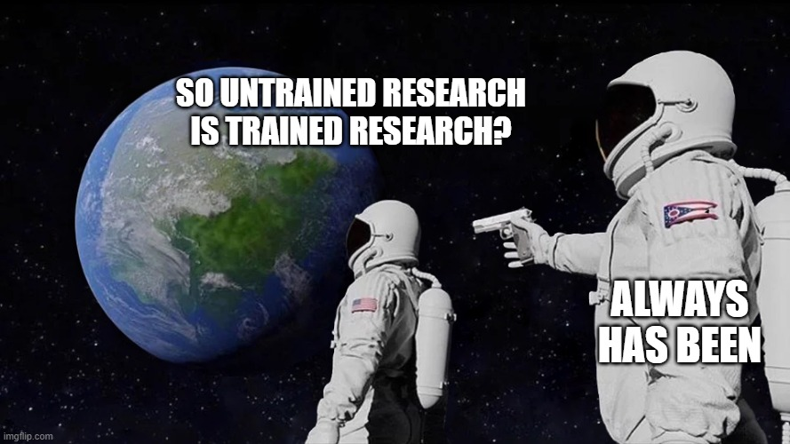
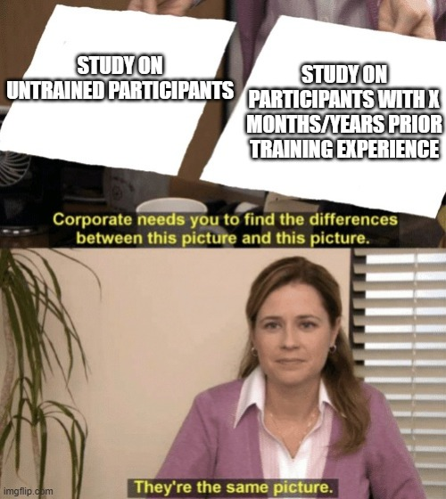
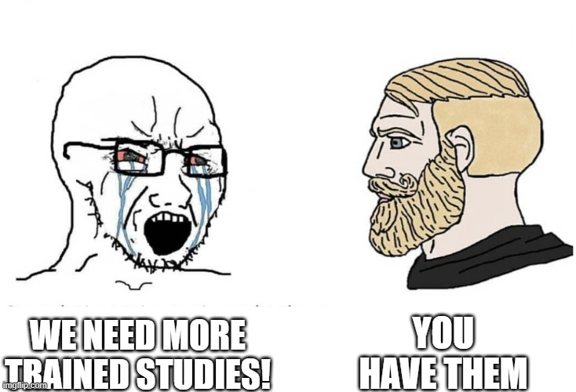

{fig-alt="Astronaut meme reading: So untrained research is trained research? Always has been." fig-align="center" width="760"}

*An original version of this note was posted on both LinkedIn and Instagram on 10 June 2026 prior to my deleting my social media accounts. But, as I and colleagues were discussing this recently, I decided to revive the post, update it, and repost as an excuse to add some funny memes we'd shared with each other too.* 

When a study describes its participants as “trained”, the label often carries a lot of weight for folks in the so-called "science-based" lifting space. People are constantly clamouring for more studies on trained lifters and complain that studies on untrained participants don't tell us anything relevant for the former. But, what if I were to tell you that there's very likely not a whole lot of difference between most existing studies of "untrained" and "trained" lifters. 

Fry and colleagues, in their recent scientometric review[^1] titled [Tons of resistance exercise research, but does it apply to highly trained athletes?](https://pubmed.ncbi.nlm.nih.gov/42417489/), highlight the issue right from the get-go noting that "...the use of vague study subject descriptors such as “trained” or “untrained” lead to confusion." They also highlight the usual refrain from people that there are relatively few studies of "trained" or "highly trained" individuals[^2]. Across recent systematic reviews and meta-analyses the included studies were, by and large (70.5%), conducted in untrained and previously sedentary participants.

[^1]: Hat tip to Drs Helms and Trexler over at the [MASS Research Review](https://massresearchreview.com/) and [Iron Culture](https://massresearchreview.com/resources/podcasts/ironculture/). I'd initially missed this paper being published but picked up on it as it was discussed on their [recent podcast episode](https://www.youtube.com/watch?v=vjN-1IuBC0w) and covered in MASS.

[^2]: Fry and colleagues based their classification of participant training status based upon the [recent system proposed by McKay et al.](https://journals.humankinetics.com/view/journals/ijspp/17/2/article-p317.xml). Though this classification system and others (e.g., [this one by Santos Junior et al.](https://www.ovid.com/jnls/nsca-scj/abstract/10.1519/ssc.0000000000000627~classification-and-determination-model-of-resistance?redirectionsource=fulltextview)) have tended to also include performance levels, for the purpose of this note I am more interested in the conceptualisation of "training status" as being related to the extent of prior exposure to training. Whilst the two are related given we know that training is effective to increase performance, some folks will just never ever get to a status that would be considered to fit the higher tiers of these systems no matter how much they train. Similarly, some folks are elite, and even more rarely world class, with little to no training whatsoever. Intercept variance is our biggest source of variance here. Others such as [Buckner and colleagues have argued](https://pubmed.ncbi.nlm.nih.gov/28066901/) that performance doesn't tell us much about training status. If we want to see how training effects are conditional upon performance level then selecting individuals with high levels of the performance outcome of interest (and perhaps with or without prior training) would be a desirable design characteristic of a study. If we want to understand whether training effects are conditional on training status then we should select individuals for whom we can determine the prior training exposure in terms of time/duration and specificity.  

The distinction between trained and untrained participants matters because adaptation appears to follow a roughly linear–logarithmic course: gains are comparatively large early in exposure and diminish as effective exposure accumulates. Our [longitudinal modelling of strength adaptation](https://doi.org/10.1080/02701367.2022.2070592) in addition to a re-analysis using [meta-regression of the large RCT dataset](https://pubmed.ncbi.nlm.nih.gov/38037792/)[^3] in untrained individuals regarding adaptation over time helped establish that pattern as a theory for testing. Further, [analyses of competitive powerlifters](https://pubmed.ncbi.nlm.nih.gov/38060089/) in the [Open Powerlifting Dataset](https://openpowerlifting.gitlab.io/opl-csv/), also demonstrate this logarithmic pattern of performance increase albeit with far smaller magnitudes which we might expect if we assume that folks competing in powerlifting have typically trained somewhat before that and are consistently training pretty hard[^4]. Lastly, estimates from recent high-powered studies of genuinely well-trained [Discover Strength](https://www.discoverstrength.com/) participants[^5] have severely tested the models predictions and provided strong experimental corroboration. The effects the model predicts, and we have found in these studies, are small because these participants have already travelled a long way along the adaptation curve. 

[^3]: These re-analyses were performed as part of planning and pre-registration of our recent trials in trained participants for both strength and hypertrophy outcomes, building on our previous longitudinal modelling. You can see me talk about this "strong" theory development and testing, including these re-analyses [in this talk](https://www.youtube.com/watch?v=39Ajm1dwFx0). 

[^4]:  Meaning that they are already trained relative to say the population in our longitudinal study or the untrained populations included in the large RCT dataset, both of which yield similar magnitudes of estimates over the typical time frame for a resistance training study.

[^5]: Including our trials of [lengthened partial training](https://doi.org/10.1080/02640414.2025.2567805) and [fractional training volume](https://doi.org/10.51224/sportrxiv.810).

But, people have still been surprised by the estimated magnitudes of effects we have reported. Of course, it's not been a surprise to us; they've been incredibly close to the predictions from the theoretical linear-log model of adaptation to resistance training over time[^6]. What is surprising to people though is that they are sooo much smaller than many other studies purportedly using "trained" participants. In fact, most of the time the effect magnitudes seen in studies of "untrained" and "trained" participants are pretty much the same[^7], which could be interpreted as evidence falsifying the linear-logarithmic theory of adaptation.

[^6]: Though I will genuinely admit that it does still surprise me to this day just how close they are. This level of specification in theory such that it can yield precise quantitative predictions that are then borne out in highly powered statistical tests is certainly not a common thing outside of the far more established quantitative sciences. For sport and exercise science it is pretty much unheard of.

[^7]: For example, recent meta-analyses such as those from [Robinson et al. on proximity to failure](https://pubmed.ncbi.nlm.nih.gov/38970765/), and [Pelland et al. on training volume](https://pubmed.ncbi.nlm.nih.gov/41343037/) both found that the magnitude of estimates were relatively unaffected by whether participants in included studies were reported as "untrained" or "trained". Further, recently [the largest evidence synthesis ever performed](https://sportrxiv.org/index.php/server/preprint/view/910/version/1126) of direct hypertrophy outcomes from resistance training studies further supports our theory that effects are approximately a logarithmic function (actually, a linear AND logarithmic function) of time and that after roughly a year they begin to plateau (this is where the linear part of the function actually allows the model to plateau, the vertical dashed line on the right hand plots, whereas a log only function in this kind of data is positively monotonic everywhere). In a similar vein to the Robinson et al. and Pelland et al. analyses though, it also found no impact of participant training status on the magnitude of effects. 

However, there's an alternative explanation for why this might be the case... the "trained" participants in most[^8] of these studies are not anywhere near as trained as people think.

{fig-alt="The Office meme comparing a study on untrained participants with a study on participants reporting prior training experience; Pam says they are the same picture." fig-align="center" width="500"}

[^8]: Note, I am not saying *all*, just *most*. There are certainly studies stating participants are "trained" where we can be more certain about their prior exposures to effective training e.g., our studies with Discover Strength.

Two lines of evidence from other work we have conducted lead me to suspect this.

Generally, when folks are left to their own devices to both self-select loads, and the number of repetitions they perform (and thus proximity to failure), they generally train with ~53% of their 1RM performing sets of repetitions that leave them about ~10 repetitions shy of failure. Hardly a particularly effective stimulus. Our previous [meta-analysis of self-selected resistance exercise](https://doi.org/10.1007/s40279-022-01717-9) demonstrates this.

In addition, in our recent [study of supervision during training and effort](https://storkjournals.org/index.php/cik/article/view/8030) we took both historical training data from [Kieser Australia](https://www.kieser.com.au/) members *in situ* as well as members recruited to participate in an experimental study. We also limited this to members with at least 6 months of prior training experience at Kieser verified by their training records. In the historical *in situ* data we found that, independent of supervision, members don't train as hard as prescribed[^9]. But, in the experimental study participants train much harder[^10], both unsupervised and supervised, though train even harder when supervised[^11]. 

[^9]: They are prescribed training to failure, but are nowhere near this in practice and also use loads that are far too light.

[^10]: Perhaps a "study" effect.

[^11]: Note, members at Kieser are still adapting and gaining strength so, despite the stimulus being suboptimal in practice in comparison to what is prescribed, it's not entirely ineffective.

If it's the case that, despite reporting they have trained for X period of time, prior to participation most "trained" participants' training exposure had been this suboptimal, it's unsurprising we see effect sizes bigger than we expect based on the well corroborated linear-logarithmic theory. In contrast, the model itself shows what happens if you take participants who are untrained, or in this case relatively untrained despite nominally being classified as "trained", and then expose them to an effective training stimulus from the get-go over time. 

Considering this I have greater confidence that the studies we have performed with Discover Strength included participants that could properly be considered "trained" in some meaningful sense; they had all been training following high-effort, albeit relatively low-volume, supervised programmes for at least 6 months and typically longer. This has been one of the benefits of conducting studies with Discover Strength where, given the nature of their approach, participants recruited into the studies are probably some of the most well trained in the literature. The magnitudes of the effect estimates we subsequently find when conducting studies with this population are in fact evidence of their prior training status.

So, when folks clamour for more studies on "trained" participants, a tongue in cheek response is[^12]...

[^12]: Dr Zac Robinson gets due credit for this meme.

{fig-alt="Meme responding to demands for more studies of trained participants: You have them." fig-align="center" width="700"}

But in all seriousness it's not wrong to say we don't have much data on trained participants when we consider things this way. Training status, in my opinion, is probably better understood as accumulated *effective* exposure, not simply time since somebody first joined a gym and started sandbagging it with their mates, going through the motions. Load, effort, adherence, progression, exercise specificity and the consistency of the stimulus all contribute to how well trained someone is with respect to a given outcome such as strength performance or hypertrophy. A person may have years of “experience” yet remain relatively untrained with respect to the intervention and outcome under study. Put them into a closely monitored experiment, improve the stimulus, and a response similar to what we see in previously sedentary untrained participants is no longer surprising.

This does not mean that every unexpectedly large effect in a trained sample is explained by poor prior training, nor that findings in untrained participants automatically generalise to highly trained people. Training history may in fact modify effects both in terms of the general effect magnitude of an intervention and the comparative effects of different interventions. Also, the people who persist long enough to become genuinely well trained may also be a selected group[^13]. The narrower methodological point is that “trained” is a theoretical construct, not a box validated by asking how many months someone has exercised.

[^13]: Further adding to the point about performance itself being a poor operationalisation of training status. Those who don't perform well may be more likely to not continue with training for whatever reason.

Although not easy to do, researchers should try to better describe and, where possible, verify the training that participants actually performed before enrolment: recent loads, proximity to failure, progression, adherence and performance trajectory. Until then, much of what is called research in trained populations may be research in relatively untrained populations wearing a more impressive label than is deserved.
